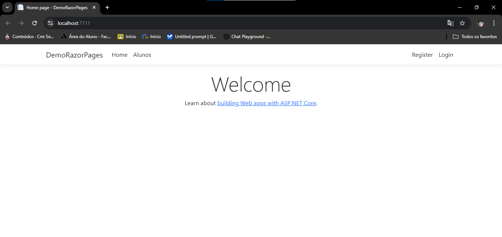

# Iniciando ASP.NET Razor Pages
Este repositório tem como objetivo servir como um ponto de partida para quem deseja aprender 
e aplicar os principais conceitos do ASP.NET Razor Pages. Ao longo deste projeto, vamos explorar 
como construir interfaces dinâmicas e interativas de forma simples e eficiente utilizando Razor 
Pages. Este modelo de programação em ASP.NET Core oferece uma abordagem mais direta e intuitiva para 
o desenvolvimento web, permitindo que você combine a lógica de negócio e a interface em uma estrutura 
organizada. Com Razor Pages, você poderá criar páginas web robustas, de fácil manutenção, e altamente 
performáticas, tornando este repositório uma excelente base para o desenvolvimento de aplicações web 
modernas.

<br>



<br>

## Criando uma Model Aluno
No projeto web app(Razor Pages) a pasta models não vem, então: 
1. Sera necessário cria-la e adicionar o Aluno.cs(e o codigo) 
2. Na pasta Pages crie a pasta Alunos.
2. Clique com o botão direito do mouse na pasta "Alunos" -> add -> new scaffolded item... -> Razor 
Pages with views - using entity Framework.
3. Após isso selecione a model criada(nesse exemplo Aluno.cs)
4. Utilize a data do projeto utilizado
5. Sera criado o "CRUD" de alunos na Pasta Alunos

## Configurando o banco de dados após inclusão da Model
- Sera necessário rodar no terminal(Package Manager Console) o comando 
para fazer as migrações da model Aluno:
	```bash
	Add migration Aluno

- E posteriormente para atualizar o banco de dados:
	```bash
	update-database